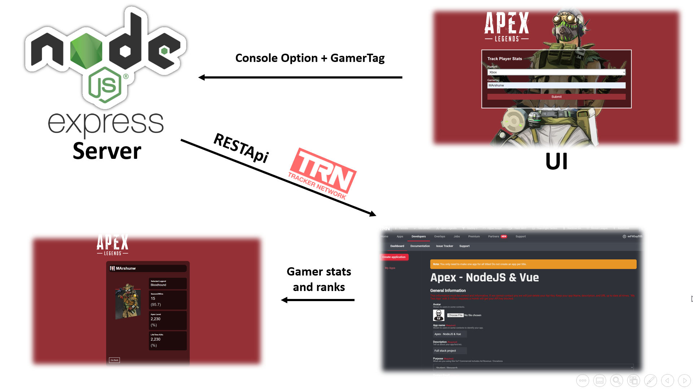

Link: https://serene-sierra-76843.herokuapp.com/

# Apex-Tracker

Full stack Vue/Express app using the Tracker Network API to track player stats


# Project Architecture:


  
# Backgroud:
As a big fan of Online gaming and especially Apex Legends, i've looked to develop a project
 that is related to one of my big passions.

# Special Features:
  - Apex Legends Stats and Leaderboards rankings.
  - Free Search Engine for every Player Across PSN,XBOX And ORIGIN.
  - Live Update 24/7 for Real WorldWide Ranks.
  
### Tech

* FRONTEND: VUE
* BACKEND: NodeJS , RESTApi, Express, Morgan, dotenv, concurrently, node-fetch, vue-spinner


### Installation

```sh
$ npm install 
$ cd client

# Install Vue dependencies
$ npm install
$ node run start

# Serve
$ npm run dev

# Build for production
$ cd client
$ npm run build

```

